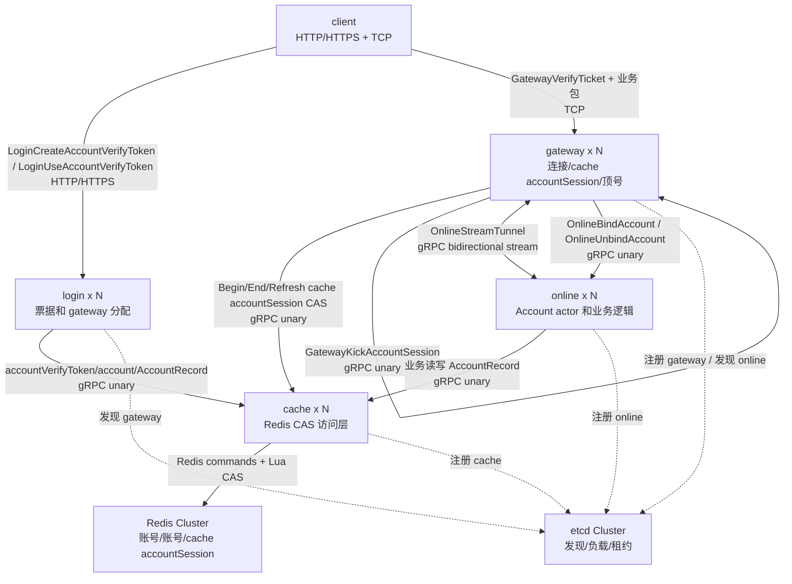
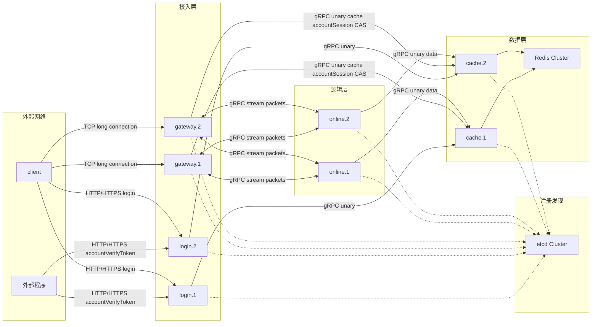
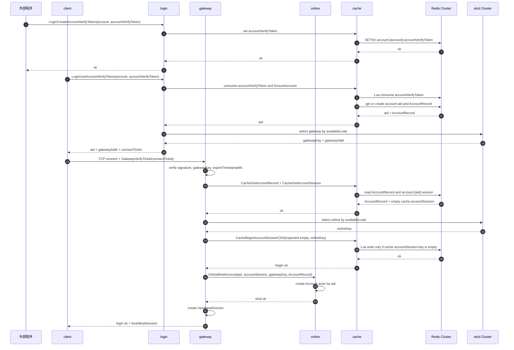
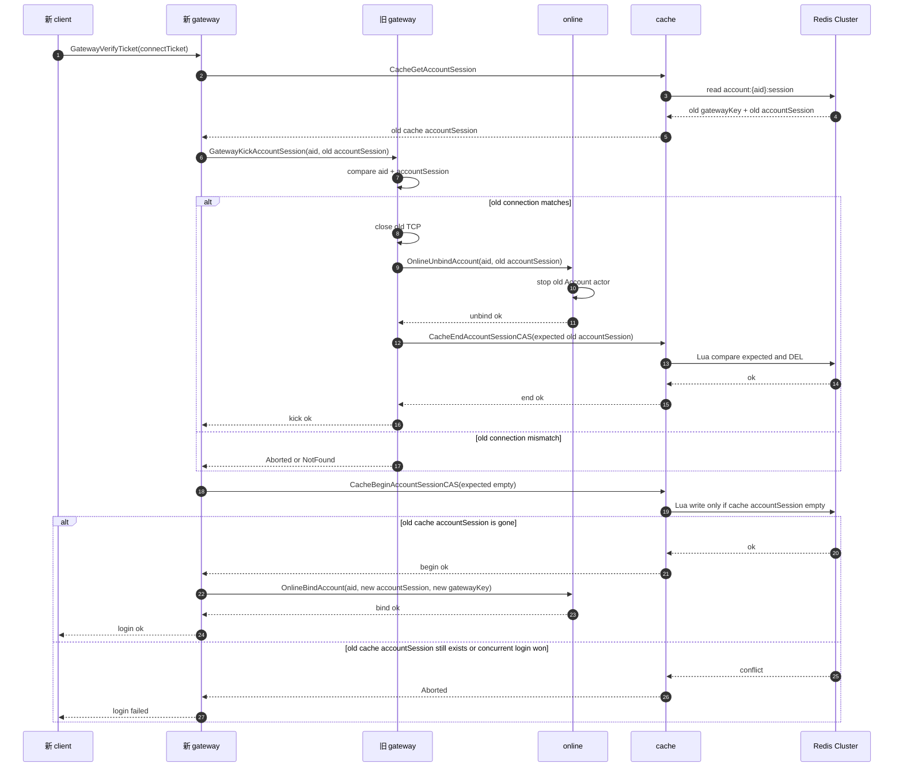
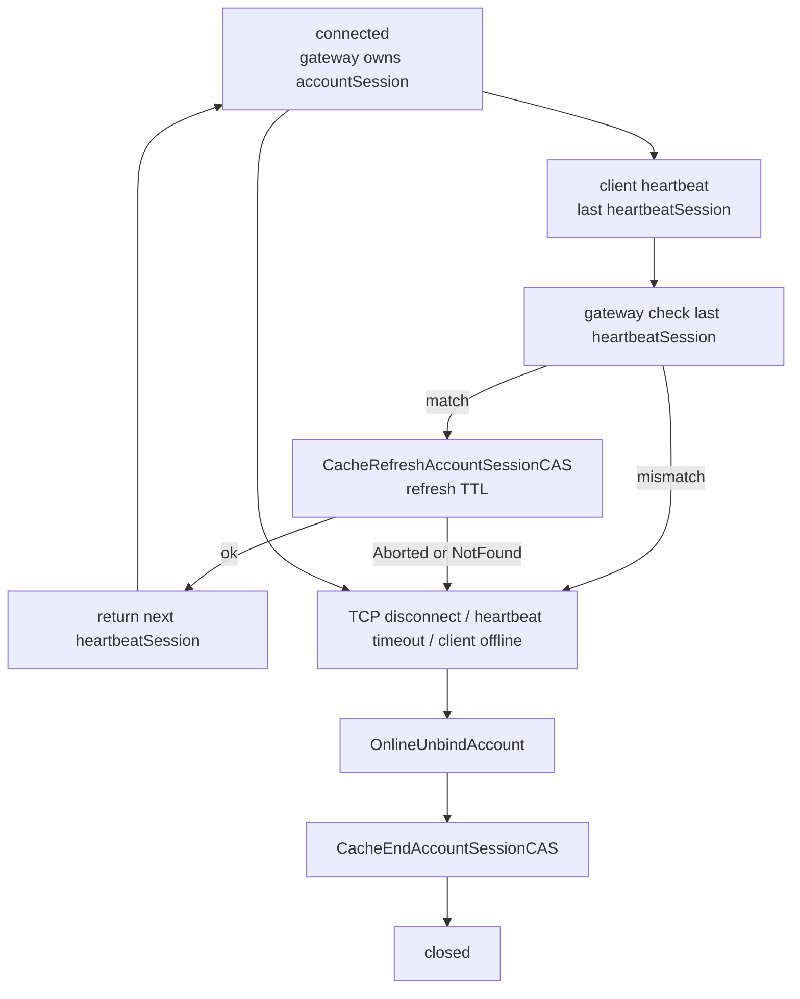
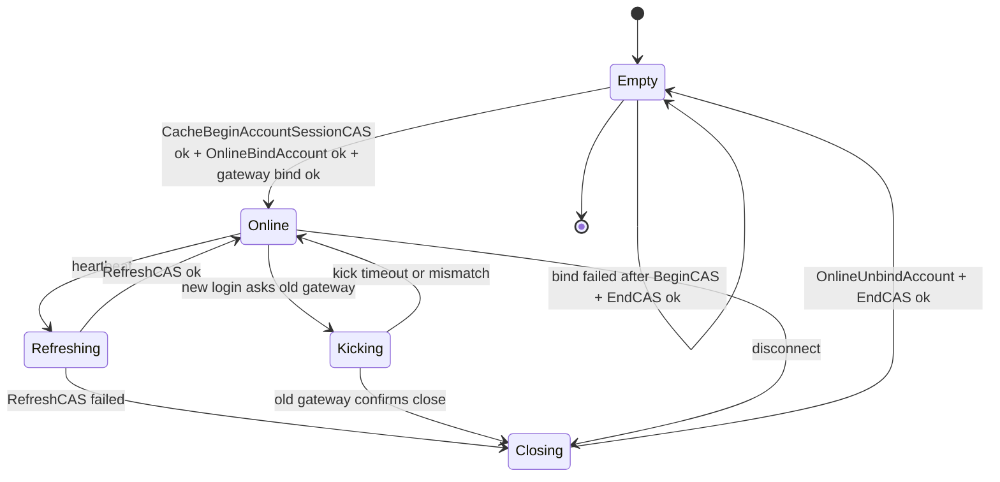

# 登录新架构设计

本文是目标新架构设计，不按当前代码流程复制。核心目标是减少登录链路中的服务握手，把“一个 aid 只能有一个有效连接”的权威集中到 cache/Redis CAS，online 只负责账号逻辑。

## 设计目标和约束

- 一个 aid 同一时间只能有一个有效 TCP 连接。
- 顶号采用严格语义：旧连接确认下线后，新连接才能上线；超时则新登录失败。
- login 不调用 gateway，不保存 pending，不参与在线态。
- gateway 负责客户端 TCP、票据校验、顶号协调、cache accountSession 续期和业务转发。
- online 负责Account actor 和业务逻辑，不负责顶号编排。
- cache 是 Redis Cluster 的唯一访问层，负责账号、账号档案、cache accountSession CAS。
- Redis Cluster 是最终一致性保护层，所有 cache accountSession 操作都必须带 expected。
- etcd Cluster 只做服务发现和负载上报，不保存账号状态。

## 更简洁的关键变化

| 现状/复杂点 | 新方案 |
| --- | --- |
| login 调 gateway 写 pending | 取消 pending，login 签发短期 `connectTicket` |
| online 编排顶号 | gateway 编排顶号，cache/Redis 判断 cache accountSession 是否可写 |
| online 维护 cache accountSession 续期 | gateway 维护 cache accountSession 续期 |
| 登录链路跨 login、gateway、online、cache 多次往返 | 登录成功前只需要 login、gateway、cache；online 只在 cache accountSession 抢占成功后绑定 |
| 顶号依赖旧 online 删除完成 | 旧 gateway 关闭连接后直接向 cache CAS 删除旧 cache accountSession |

## 服务职责

| 服务 | 职责 | 保存状态 |
| --- | --- | --- |
| client | HTTP/HTTPS 调 login，TCP 连接 gateway，发送登录票据和业务包。 | account、accountVerifyToken、connectTicket；gateway 登录成功后保存 heartbeatSession |
| login | 消费 accountVerifyToken、确保账号、选择 gateway、签发短期连接票据。 | 无在线态 |
| gateway | 校验 connectTicket，协调顶号，抢占 cache accountSession，维护 TCP，转发业务包。 | TCP remote、aid->Account、accountSession、heartbeatSession |
| online | 创建 Account actor，处理账号逻辑，接收 gateway stream 业务包。 | aid->Account actor、gateway stream |
| cache | 封装 Redis Cluster，提供 accountVerifyToken、账号、AccountRecord、cache accountSession CAS。 | Redis client、配置 |
| Redis Cluster | 保存 accountVerifyToken、account-aid、AccountRecord、cache accountSession。 | 持久/缓存数据 |
| etcd Cluster | 服务发现、负载上报、租约。 | 服务实例元数据 |

## 服务拓扑图



## 网络拓扑图



## 核心数据模型

### connectTicket

login 返回给 client 的短期连接票据，gateway 本地验签，不需要 login 先通知 gateway。

```text
connectTicket:
  aid
  account
  gatewayKey
  expireTimestampMs
  nonce
  signature = Sign(aid, account, gatewayKey, expireTimestampMs, nonce)
```

规则：

- `connectTicket` 只允许连接指定 gateway。
- `gatewayAddr` 只用于客户端建立 TCP 连接, 不进入 `connectTicket`。
- 过期后 gateway 直接拒绝。
- gateway 只需共享验签密钥或公钥，不需要 pending 表。

### accountSession

每次 TCP 登录生成固定连接身份。

```text
accountSession = random 256-bit hex
heartbeatSession = random 256-bit hex, heartbeat 后可轮换
```

规则：

- `accountSession` 标识连接生命周期，不轮换。
- `heartbeatSession` 是 gateway 在 TCP 登录成功后生成的客户端心跳认证凭证，可以轮换。

### cache accountSession

```text
account:{aid}:session
  gatewayKey
  accountSession
  loginTimestampMs
  onlineKey
```

CAS identity：

```text
accountSession
```

说明：

- gateway 是连接拥有者，所以 cache accountSession 的 CAS identity 不依赖 gatewayKey 或 onlineKey。
- gatewayKey 用于顶号时定位旧 gateway。
- onlineKey 只用于问题定位，不参与 CAS 判断。
- online 绑定失败时，gateway 按 expected 删除新 cache accountSession。
- 当前不引入 `state` 或 `binding` 字段；抢占成功后到 online 绑定完成前的崩溃窗口依赖 cache accountSession TTL 释放。
- `heartbeatSession` 不进入 Redis，只保存在 gateway 本地和客户端。
- `heartbeatSession` 不进入 `connectTicket`，login 不生成心跳凭证。

## 目标接口

| 接口 | 调用方 -> 被调方 | 作用 |
| --- | --- | --- |
| `LoginCreateAccountVerifyToken` | 外部程序 -> login | 写入 accountVerifyToken |
| `LoginUseAccountVerifyToken` | client -> login | 消费 accountVerifyToken，返回 aid、gatewayAddr、connectTicket |
| `GatewayVerifyTicket` | client -> gateway | TCP 登录验证 connectTicket |
| `CacheGetAccountSession` | gateway -> cache | 读取旧 cache accountSession |
| `CacheBeginAccountSessionCAS` | gateway -> cache | expected 为空时写入新 cache accountSession，要求 Redis 当前无 cache accountSession |
| `GatewayKickAccountSession` | 新 gateway -> 旧 gateway | 断开指定 aid + accountSession 的旧连接 |
| `CacheEndAccountSessionCAS` | gateway -> cache | 按 expected 删除旧 cache accountSession |
| `OnlineBindAccount` | gateway -> online | cache accountSession 抢占成功后创建 Account actor |
| `OnlineUnbindAccount` | gateway -> online | 连接结束后释放 Account actor |
| `CacheRefreshAccountSessionCAS` | gateway -> cache | 心跳续期 |

## 账号首次登录流程图



首次登录要点：

- 账号 HTTP/HTTPS 只连 login，TCP 只连 gateway。
- login 只选 gateway，不和 gateway 建立 pending。
- gateway 先读取 AccountRecord 和旧 cache accountSession，再抢占 cache accountSession，最后绑定 online。
- gateway 在写新 cache accountSession 前先选择 online，使 cache accountSession 中能记录 `onlineKey` 用于排障。
- online 只在 cache accountSession 抢占成功后创建 Account actor。
- Redis CAS 保证并发首次登录只有一个能写入 cache accountSession。

## 已在线账号顶号流程图



顶号规则：

- 新 gateway 不直接覆盖旧 cache accountSession。
- 旧 gateway 必须确认关闭指定 `accountSession`。
- 旧 gateway 负责删除旧 cache accountSession。
- 新 gateway 重新 begin 成功后，才允许绑定 online 并返回客户端成功。
- 新 gateway 不在 kick 成功后做二次 `CacheGetAccountSession`，而是直接依赖 `CacheBeginAccountSessionCAS(expected empty)` 判断旧 cache accountSession 是否已清空。
- 任一步超时、不可达、不匹配，新登录失败。

## 断线、心跳和续期流程图



## 账号 cache accountSession 状态流转



## 详细数据流

```mermaid
flowchart TD
    subgraph Ticket["票据流"]
        T1["External -> login<br/>LoginCreateAccountVerifyToken"]
        T2["login -> cache<br/>set accountVerifyToken"]
        T3["cache -> Redis<br/>account:{account}:accountVerifyToken"]
        T1 --> T2 --> T3
    end

    subgraph LoginFlow["登录票据使用流"]
        L1["client -> login<br/>LoginUseAccountVerifyToken"]
        L2["login -> cache<br/>consume accountVerifyToken + EnsureAccount"]
        L3["login -> etcd<br/>select gateway"]
        L4["login -> client<br/>connectTicket + gatewayAddr"]
        L1 --> L2 --> L3 --> L4
    end

    subgraph GatewayFlow["gateway 单登录流"]
        G1["client -> gateway<br/>GatewayVerifyTicket"]
        G2["gateway -> cache<br/>CacheGetAccountSession"]
        G3["gateway -> old gateway<br/>GatewayKickAccountSession if old exists"]
        G4["gateway -> cache<br/>CacheBeginAccountSessionCAS(expected empty)"]
        G5["gateway -> online<br/>OnlineBindAccount"]
        G1 --> G2 --> G3 --> G4
        G2 --> G4 --> G5
    end

    subgraph PacketFlow["业务包流"]
        P1["client TCP packet"]
        P2["gateway Account"]
        P3["OnlineStreamTunnel"]
        P4["online Gateway stream actor"]
        P5["online Account actor"]
        P1 --> P2 --> P3 --> P4 --> P5
    end

    subgraph OfflineFlow["离线流"]
        O1["gateway detects disconnect"]
        O2["gateway -> online<br/>OnlineUnbindAccount"]
        O3["gateway -> cache<br/>CacheEndAccountSessionCAS"]
        O1 --> O2 --> O3
    end
```



## 失败语义和一致性规则

- accountVerifyToken 使用成功即消费；后续失败需要重新发 accountVerifyToken。
- connectTicket 过期、验签失败、gatewayKey 不匹配时，gateway 拒绝登录。
- `CacheBeginAccountSessionCAS` 成功前，不创建 online Account actor。
- `OnlineBindAccount` 或 gateway 本地绑定失败时，gateway 必须删除新 cache accountSession。
- `CacheGetAccountSession` 对空 cache accountSession 返回 `NotFound`，对字段缺失或格式错误返回 `DataLoss`；脏 cache accountSession 不能绕过顶号流程。
- 当前 cache accountSession 不保存 `binding` 状态；gateway 在 Begin 成功后、Bind 完成前崩溃时，残留 cache accountSession 依赖 TTL 过期。
- 顶号时旧 gateway 不可达、旧连接不匹配、旧 cache accountSession 删除失败、流程超时，新登录失败。
- 旧请求迟到时，Redis CAS 因 expected 不匹配而拒绝，不能误删新 cache accountSession。
- gateway 是账号连接的 owner，负责 refresh 和 end cache accountSession。
- online 是业务 actor owner，不负责决定账号能否上线。
- cache 不做业务选择，只做 Redis 原子读写和 CAS。
- gateway 到 cache 的 unary 默认 `3s` 超时，到 online bind/unbind 和旧 gateway kick 默认 `60s` 超时。
- 边界错误映射统一在 login HTTP 和 gateway TCP 侧完成，服务间只传 gRPC status code。

## 与当前实现差异

- 取消 login 到 gateway 的本地 pending 准备流程，改为短期签名 `connectTicket`。
- 顶号从 online 编排改为 gateway 编排，online 不再参与踢旧号决策。
- cache accountSession CAS identity 简化为 `accountSession`，`gatewayKey` 和 `onlineKey` 只作为定位元数据。
- 心跳续期由 gateway 发起，online 不负责 cache accountSession TTL。
- online 只在 gateway 成功抢占 cache accountSession 后绑定 Account actor，失败时不创建业务 actor。
- 登录链路少一次 login->gateway RPC，顶号链路少一次 old gateway->old online->cache 的强依赖。
