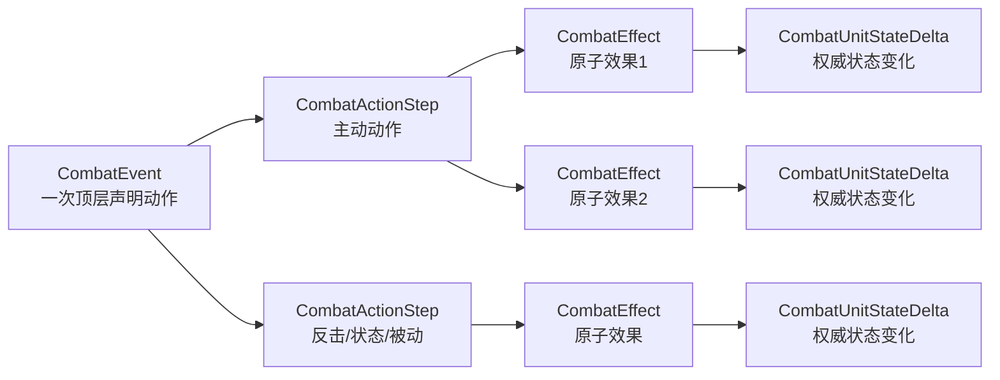

# CombatEvent战斗事件协议

更新时间: 2026-07-30.

## 1. 结论

当前`CombatEvent`可以结构化表达本次需求中的以下结果:

- 普通攻击, 合击, 连续攻击和完整反击链.
- 命中, 未命中, 闪避, 暴击, 防御, 倒地和击飞.
- 毒, 石化, 混乱, 睡眠, 麻痹和泥醉的新增、更新、移除、跳数及实际改写动作.
- 属性反转, 场地属性变化和单次攻击元素转换.
- 捕获, 换宠, 使用道具, 换装和逃跑的请求及结果结构.
- 守护无效化, 吸收, 反射, 陷阱, 忠犬和针刺等受击反应.

协议覆盖不等于业务逻辑已经开放. 当前角色动作分派器只实现`8000001`攻击、`8000002`防御和`8000003`逃跑. `skill.yaml`中的`8000004`至`8000007`、`8100000`、`8100003`和`8100010`至`8100018`仍缺少角色侧配置解析、参数校验及执行器. 协议已经为这些动作保留明确结构, 但服务端现在不会从真实请求生成对应结果.

“属性转换”如果指元素相克反转、场地元素或本次攻击元素, 分别由`element_reverse`、`field_attribute`和`attack_element`表达. 攻击、防御、敏捷百分比状态使用`attribute_modifier`, 独立闪避提升使用`dodge_boost`, 狐狸或狼形态使用`transformation`. 生产协议不再提供通用文本效果, 客户端只根据具体PB字段生成本地化展示.

## 2. 三层职责



- `CombatEvent`表示一次顶层出手. 顶层声明来源和目标只在这里记录一次. 反击不会创建新的`CombatEvent`.
- `CombatActionStep`表示一次实际发生的动作或结算步骤. 主动动作、反击、状态跳数和被动触发使用同一结构; 未执行动作不写入协议.
- `CombatEffect`表示动作中的一个有序原子效果. 效果类型只由`detail oneof`决定.
- `CombatUnitStateDelta`是HP、MP、状态、存活和离场的唯一权威变化. 客户端不得从表现伤害反推HP.

`CombatUnitStateDelta`有意保留在`CombatEffect`公共层, 不拆进每个detail. Damage、Heal、Status、Reaction等都可能产生相同的HP、状态或离场差量; 如果分别复制字段, 客户端必须维护多套读取路径, 也会允许“detail中的数值”和“公共差量”互相冲突. detail负责说明变化的业务原因和专用参数, `unit_delta_list`只负责变化后的权威状态.

客户端固定按以下顺序消费:

```text
round.event_list
  -> event.action_step_list
    -> action_step.effect_list
      -> effect.unit_delta_list
```

同一层列表顺序就是逻辑顺序. 协议不再发送额外事件ID、父事件ID或动画调度字段.

## 3. A攻击B, B反击

一次`A攻击B -> B反击A`只使用一个`CombatEvent`:

```text
CombatEvent {
  declared_source_unit_key_list: [A]
  declared_target_unit_key_list: [B]

  action_step_list: [
    {
      cause: Active
      skill_id: 8000001
      actor_unit_key: A
      action_target_unit_key_list: [B]
      effect_list: [
        {
          effect_source_unit_key: A
          affected_unit_key_list: [B]
          damage: {
            displayed_damage: 35
            outcome: Hit
            critical: false
            guarded: false
          }
          unit_delta_list: [
            { unit_key: B, HP: { delta: -35, after: 65 } }
          ]
        }
      ]
    },
    {
      cause: Counter
      skill_id: 9000002
      actor_unit_key: B
      action_target_unit_key_list: [A]
      effect_list: [
        {
          effect_source_unit_key: B
          affected_unit_key_list: [A]
          damage: {
            displayed_damage: 18
            outcome: Hit
          }
          unit_delta_list: [
            { unit_key: A, HP: { delta: -18, after: 82 } }
          ]
        }
      ]
    }
  ]
}
```

如果A再次反击B, 继续在同一个`action_step_list`末尾追加`cause=Counter`的步骤. 反击发生序号直接由列表下标得到, 因此协议不重复保存反击序号或深度.

## 4. 命中结果

攻击判定统一使用`CombatEffect.damage`. 未命中和闪避不再各维护一套空`oneof`分支.

| 情况 | `damage.outcome` | `critical` | `guarded` | `unit_delta_list` |
|---|---|---:|---:|---|
| 普通命中 | `Hit` | false | false | 实际HP变化 |
| 未命中 | `Miss` | false | false | 通常为空 |
| 闪避 | `Dodge` | false | false | 为空 |
| 暴击 | `Hit` | true | false | 实际HP变化 |
| 防御减伤 | `Hit` | false或true | true | 减伤后的实际HP变化 |

`displayed_damage`只用于表现. 它可以大于目标剩余HP, 也可以因吸收、反射或旧规则而与实际HP变化不同. 实际扣血只读取同一效果中的HP delta.

结算时没有有效目标不是“命中失败”. 此时动作没有实际发生, 不生成`CombatActionStep`; 如果该行动时点也没有产生状态变化, 整个顶层事件都不下发.

## 5. 倒地和击飞

一次致死攻击先产生`Damage`, 再产生且只产生`Knockdown`或`Knockback`中的一种表现效果. 例如单次过量伤害击飞:

```text
effect_list: [
  Damage {
    unit_delta_list: [
      { unit_key: B, HP: { delta: -50, after: 0 }, alive: false }
    ]
  },
  Knockback {
    affected_unit_key_list: [B]
    knockback_type: SingleHitOverkill
    from_position: ...
  }
]
```

死亡只由`alive_changed=true, alive=false`表达. `Knockdown`、累计过量伤害的直接击飞和单次过量伤害的反弹击飞是互斥的死亡表现; `Knockdown`和`Knockback`详情不重复保存来源和目标.

## 6. 连续攻击和合击

`skill.yaml`中的`8100010`至`8100018`分别声明2至10段攻击. 每个实际执行段生成一个动作步骤, 协议只通过列表顺序表达播放顺序:

```text
step 1: skill_id=8100012
step 2: skill_id=8100012
step 3: skill_id=8100012
step 4: skill_id=8100012
step 5: cause=Counter
```

每段是一个`CombatActionStep`, 每段内部仍可有多个效果. 客户端按照`action_step_list`顺序播放, 不显示或依赖段号与总段数. 反击只在实际触发位置追加, 不需要“预留段”或空步骤.

合击使用:

```text
declared_source_unit_key_list: [A, C, D]
declared_target_unit_key_list: [B]
```

来源列表顺序就是合击成员顺序. 每名成员各有自己的`CombatActionStep`. 效果的直接来源可以是B, 例如反射伤害, 但它仍留在触发该反应的成员动作内.

## 7. 异常状态

状态变化统一放在`CombatEffect.status -> unit_delta_list.status_delta_list`.

```text
status_delta {
  status_type: Poison
  delta_type: Add
  duration_after: {
    unit: Action
    remaining: 5
  }
}
```

支持的状态包括:

| 状态 | `CombatStatusType` | 典型后续动作 |
|---|---|---|
| 毒 | `Poison` | `cause=Status`的Damage, 然后Update或Remove |
| 石化 | `Stone` | 原动作不下发; 状态变化单独使用Status步骤 |
| 混乱 | `Confusion` | 只下发改写后的实际动作, Event声明目标与ActionStep实际目标可以不同 |
| 睡眠 | `Sleep` | 原动作不下发; 被伤害唤醒时发送Remove |
| 麻痹 | `Paralysis` | 原动作不下发, 每次行动机会递减 |
| 泥醉 | `Drunk` | 动作仍可能执行, 状态按Action更新或移除 |

### 7.1 毒跳数

```text
CombatActionStep {
  cause: Status
  actor_unit_key: B
  action_target_unit_key_list: [B]
  effect_list: [
    Damage {
      effect_source_unit_key: B
      affected_unit_key_list: [B]
      unit_delta_list: [{ unit_key: B, HP: { delta: -8, after: 42 } }]
    },
    Status {
      unit_delta_list: [{
        unit_key: B
        status_delta_list: [{
          status_type: Poison
          delta_type: Update
          duration_after: { unit: Action, remaining: 3 }
        }]
      }]
    }
  ]
}
```

### 7.2 石化、睡眠和麻痹阻止动作

```text
CombatActionStep {
  cause: Status
  actor_unit_key: B
  action_target_unit_key_list: [B]
  effect_list: [
    Status {
      unit_delta_list: [{
        unit_key: B
        status_delta_list: [{
          status_type: Stone
          delta_type: Remove
        }]
      }]
    }
  ]
}
```

轮到B时如果石化仍阻止行动, B原本声明的主动动作不写入协议. 只有状态递减到期、跳伤或其他实际变化才生成`cause=Status`步骤; 没有任何变化时不生成事件. 该行动时点一旦跳过, 本回合稍后解除状态也不会补执行原动作.

### 7.3 混乱改写动作

```text
CombatEvent {
  declared_source_unit_key_list: [A]
  declared_target_unit_key_list: [B]
  action_step_list: [{
    cause: Active
    skill_id: 8000001
    actor_unit_key: A
    action_target_unit_key_list: [A]
  }]
}
```

客户端只显示和回放ActionStep实际字段. Event顶层声明目标仍可与实际目标对照; 原始技能和改写原因不下发, 客户端也不需要据此重算混乱逻辑.

## 8. 属性相关结果

| 情况 | oneof分支 | 说明 |
|---|---|---|
| 属性相克反转 | `element_reverse` | `enabled`表示变化后的状态 |
| 场地属性变化 | `field_attribute` | 元素、强度、剩余时长及清除标记 |
| 本次攻击元素转换 | `attack_element` | 必须放在同一步骤的Damage之前 |
| 攻防敏百分比修正 | `attribute_modifier` | 属性类型、百分比、启用状态和剩余时长 |
| 独立闪避提升 | `dodge_boost` | 成功区间、启用状态和剩余行动次数 |
| 狐狸或狼变身 | `transformation` | 形态、攻防敏修正、启用状态和剩余时长 |

示例:

```text
effect_list: [
  AttackElement { element: Fire, power: 100 },
  Damage { outcome: Hit, displayed_damage: 40, ... }
]
```

客户端按效果顺序播放, 但伤害公式和最终数值始终由服务端决定.

## 9. 受击反应

`reaction`只保存反应事实和结算后的剩余时长. 反射伤害或吸收治疗的数值由紧邻的Damage或Heal效果表达, 不在Reaction中重复.

| `reaction_type` | 结构化结果 |
|---|---|
| `Vanish` | 原Damage显示0, Reaction记录触发及剩余Hit次数 |
| `Absorb` | 原Damage显示0, Reaction后追加Heal |
| `Reflect` | 原Damage显示0, Reaction后追加防守方对攻击方的Damage |
| `Trap` | 原Damage显示0, Reaction后按规则追加Damage |
| `Guardian` | Reaction说明守护触发, 实际Damage目标改为守护者 |
| `Acupuncture` | Reaction说明针刺触发, 后续Damage作用于攻击方 |

客户端可根据Reaction、Damage、Heal和delta生成本地化说明, 服务端不再额外下发文本效果.

## 10. 战斗结算

`CombatRoundResultNotify.settlement`只在战斗结束时携带, 包含全局胜负和当前接收角色可见的私有奖励摘要:

- `battle_result`: 发起方或防守方胜利.
- `exp_reward_list`: 当前角色及其战宠实际持久化的经验增量.
- `duel_point_change`: 当前角色实际持久化的DP差量和变化后值.
- `item_reward_list`: 当前角色实际写入背包的道具ID及按ID汇总后的数量.

结算字段只承担结果展示, 账号档案仍由独立权威状态同步维护. DP和道具不得再编码成战斗文本, 客户端也不得解析日志恢复奖励语义.

## 11. `skill.yaml`技能映射

| 技能 | 请求字段 | 成功结果 | 当前服务端执行状态 |
|---|---|---|---|
| `8000001`攻击 | `arg_target_unit` | Damage及派生效果 | 已实现 |
| `8000002`防御 | 无 | Guard | 已实现 |
| `8000003`逃跑 | 无 | Escape及escaped delta | 已实现 |
| `8000004`捕获 | `arg_target_unit` | Capture, 成功时UnitLeave | 未实现 |
| `8000005`换宠 | `arg_switch_pet_uuid` | UnitLeave后UnitEnter | 未实现 |
| `8000006`使用道具 | `arg_item_id/uuid/count` | ItemUsed后Heal/Status等 | 未实现 |
| `8000007`更换装备 | `arg_equipment_type/uuid` | EquipmentChanged | 未实现 |
| `8100000`待机 | 无 | 空`effect_list`的实际动作步骤 | 角色入口未实现 |
| `8100003`破除防御 | `arg_target_unit` | Damage, `guarded`按实际结算 | 角色入口未实现 |
| `8100010-8100018`连续攻击 | `arg_target_unit` | 2至10个有序步骤 | 角色入口未实现 |

角色连续攻击还有一个明确配置缺口: `CharacterSkillEntry`当前只读取`id/name/description`, 会忽略`continuationAttack.segmentCount`. 要真正开放`8100010`至`8100018`, 必须先把该节点加入服务端和客户端角色技能配置模型及校验, 再复用现有连续攻击执行器.

## 12. 全部`CombatEffect.detail`分支

| 分支 | 用途 |
|---|---|
| `damage` | 命中、未命中、闪避、暴击、防御和表现伤害 |
| `heal` | 治疗, 数值读取HP delta |
| `guard` | 主动防御动作 |
| `status` | 状态新增、更新和移除 |
| `knockdown` | 倒地位置和特殊返位顺序 |
| `knockback` | 击飞类型和起始位置 |
| `escape` | 逃跑成功或失败 |
| `equipment_changed` | 变化后的完整装备 |
| `reaction` | 守、光、镜、陷阱、忠犬和针刺 |
| `element_reverse` | 属性相克反转 |
| `field_attribute` | 场地属性 |
| `attack_element` | 本次攻击元素 |
| `capture` | 捕获成功或失败 |
| `unit_enter` | 换宠等单位入场 |
| `unit_leave` | 换宠、捕获或战败离场 |
| `item_used` | 实际消耗的道具 |
| `attribute_modifier` | 攻击、防御或敏捷百分比修正及剩余时长 |
| `dodge_boost` | 独立闪避成功区间及剩余行动次数 |
| `transformation` | 狐狸或狼形态、属性修正及剩余时长 |

## 13. 已删除的冗余

本次破坏性重构删除了以下重复或歧义表达:

- 删除`CombatStepKind + CombatEffectKind + detail`三套类型来源, 只保留`cause + detail oneof`.
- 删除“一项效果一个步骤”的扁平结构, 一个动作的全部效果统一放入`effect_list`.
- 删除`ActionOnly`效果. 真实执行且无附加效果时直接使用空`effect_list`.
- 删除独立`Miss`和`Dodge oneof`. 两者统一由`damage.outcome`表达.
- 删除组合式`hit_result_list`. 命中结果互斥, 暴击和防御改为独立布尔修饰.
- 删除线上`applied_hp_damage/hp_before/hp_after`. 实际变化只读HP delta.
- 删除Knockdown和Knockback详情中重复的来源及目标.
- 删除`counter_index/counter_depth`. 当前反击链是线性有序步骤, `cause=Counter`标识反击, 列表顺序表达先后; 服务端内部仍保留反击计数用于结算和次数限制.
- 删除`segment_index/segment_count`. 连续攻击的实际执行段已经按顺序各占一个动作步骤, 客户端只需顺序播放; 计划段数仍保留在服务端内部用于随机、循环和伤害分摊.
- 删除`CombatActionStep.declared_skill_id/declared_target_unit_key_list`. 客户端只消费实际技能和目标; 顶层原始目标由`CombatEvent.declared_target_unit_key_list`统一表达.
- 删除`CombatActionStep.resolution`及其结果、原因枚举. 步骤存在即表示动作或状态结算实际发生; 未执行动作不下发.
- 删除`Reaction.amount`. 伤害和治疗数值只在Damage、Heal及delta中出现.
- 删除原始`status_id/stack_after/expire_round`, 改为枚举状态和带单位的`duration_after`.
- 删除`CombatTextDetail`并保留原字段号和字段名. 新语义必须新增具体detail, 客户端不得从展示文本解析机器语义.

以下看似重复的字段属于有意保留:

- Event声明来源/目标和ActionStep的`actor_unit_key/action_target_unit_key_list`: 混乱、合击和目标重选需要同时观察两者.
- ActionStep的`action_target_unit_key_list`和CombatEffect的`affected_unit_key_list`: 反射、忠犬和多目标技能的直接效果对象可能不同.
- `displayed_damage`和HP delta: 过量伤害、吸收、反射及旧规则会让表现值与实扣值不同.

三个空详情消息`CombatHealDetail`、`CombatGuardDetail`和`CombatStatusDetail`目前只承担oneof类型标签. Heal的实际资源变化、Status的类型和时长统一读取`unit_delta_list`, Guard受击减伤读取后续`damage.guarded`. 保留命名消息可以维持明确分支并允许以后兼容新增专用字段; 改成通用Empty只能少三个空消息定义, 可维护性收益不足.

## 14. 仍需补齐的业务实现

协议层已经覆盖本次列举场景, 但完整上线还缺少:

1. 角色`8000004`至`8000007`的请求校验、资源变更事务和执行器.
2. 角色`8100000`、`8100003`及`8100010`至`8100018`的配置解析和动作分派.
3. 捕获成功后的宠物记录创建、容量检查和战斗外权威通知.
4. 换宠的站位、行动资格、离场状态清理及新单位快照.
5. 道具和换装的库存扣减、失败回滚、战斗属性重算及持久化.
6. 客户端对Capture、UnitEnter、UnitLeave、ItemUsed、EquipmentChanged、AttributeModifier、DodgeBoost和Transformation的专用动画.

这些缺口不能只靠新增protobuf字段解决, 必须分别完成服务端规则、事务、客户端表现和回归测试.
